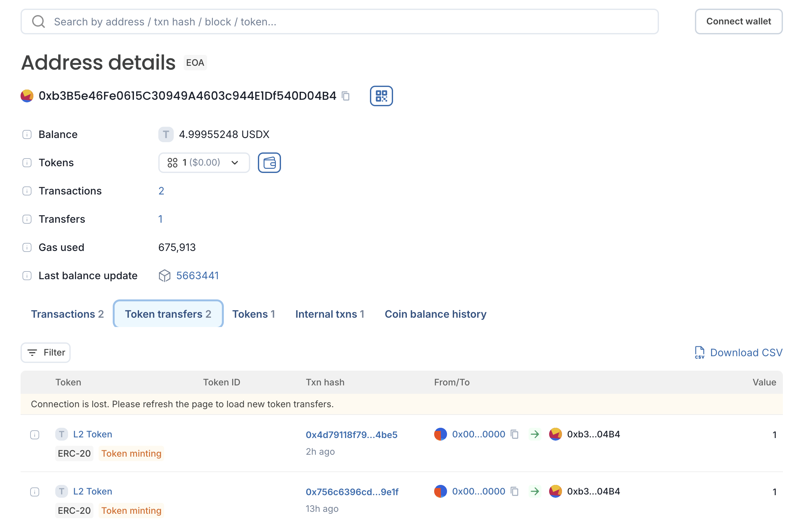

# Ozean Bridge:

This repository demonstrates the creation of an ERC20 token on the Sepolia testnet and its bridged representation on Ozean L2, utilizing the OP Standard Bridge architecture. The setup includes all necessary smart contracts, deployment scripts, and test cases for reliable bridging between Layer 1 (L1) and Layer 2 (L2).

## Required dependencies:
- forge install OpenZeppelin/openzeppelin-contracts --no-commit

## Prerequisites:

- Keep a copy of .env.example to .env and update the private-key and other details
- Make sure to fund both L1 and L2 tokens in the deployer account

## Deployed Contract Addresses:

Deployer: 0xb3B5e46Fe0615C30949A4603c944E1Df540D04B4
L1 Token:  0x25C6aA487F1944c4A2C1e8812e0AafF5E2da2a92
L2 Token: 0x5b73C5498c1E3b4dbA84de0F1833c4a029d90519

## How to deploy/execute contracts:

- Deploy L1 Token:

```sh
forge script scripts/DeployL1Token.s.sol --rpc-url <SEPOLIA_RPC_URL> --private-key <PRIVATE_KEY> --broadcast
```
✅  [Success] Hash: 0x924b3c5363dad5ca386d4c25f920e61d578f8d76814bd8af219bdec44448cdae

Contract Address: 0x25C6aA487F1944c4A2C1e8812e0AafF5E2da2a92

Block: 7427090

- Deploy L2 Token:

```sh
forge script scripts/DeployL2Token.s.sol --rpc-url <OZEAN_RPC_URL> --private-key <PRIVATE_KEY> --broadcast
```

✅  [Success] Hash: 0x4c62333f1e60f0c1ba5c58e4cb221cb839c2f7347fa066d31cebf77a22bcd0a5

Contract Address: 0x25C6aA487F1944c4A2C1e8812e0AafF5E2da2a92

- Bridge from L1 to L2 Token:
```sh
forge  script scripts/BrigeFromL1ToL2.s.sol --rpc-url <SEPOLIA_RPC_URL> --broadcast
```

✅  [Success] Hash: 0x2b03f54721cac8e28189562871794ccf3035cc74b3b7922bcda5b708c2a94f46

Block: 7427386

Paid: 0.00063932333807119 ETH (46367 gas * 13.78832657 gwei)

✅  [Success] Hash: 0x68e093e4bb40e3645e81f1cb97fe7d893f0d62a944d6392e80982d04a9aa7e42

Block: 7427386

Paid: 0.0026939632452466 ETH (195380 gas * 13.78832657 gwei)

Note: You can validate the balance 



